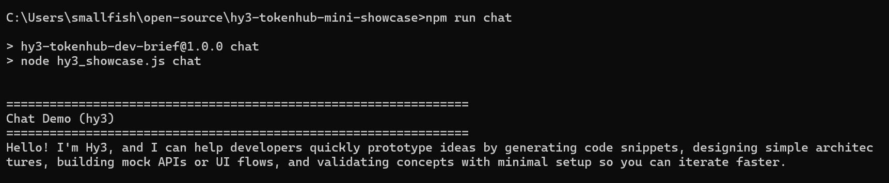
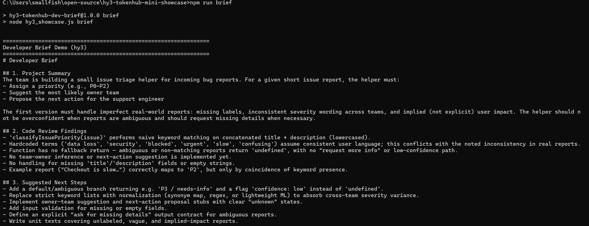

# Hy3 TokenHub Developer Brief CLI

This is a tiny developer workflow showcase for Hy3 through Tencent Cloud TokenHub. Instead of being only a raw API example, it reads a project note and a code sample, then asks Hy3 to generate a structured developer brief.

This showcase exercises Hy3's reasoning capability: it analyzes a project note and a JavaScript code sample, identifies concrete issues, and generates a structured developer brief. The showcase runs on the same Tencent Cloud TokenHub cloud API mode verified across the Hy3 integration guides.

It is intentionally independent from the Hy3 repository so reviewers can inspect and run the integration flow without pulling in the larger project.

The showcase demonstrates Hy3 capabilities for:

- Summarization
- Code understanding
- Structured generation
- Next-step planning

## Requirements

- Node.js 18 or later
- A Tencent Cloud TokenHub API key with access to the `hy3` model

## Configuration

- Endpoint: `https://tokenhub.tencentmaas.com/v1/chat/completions`
- Model: `hy3`
- API key env var: `TOKENHUB_API_KEY`

## Setup

Install dependencies:

```bash
npm install
```

Create a local environment file from the example:

```bash
cp .env.example .env
```

On Windows PowerShell, you can use:

```powershell
Copy-Item .env.example .env
```

Edit `.env` and replace the placeholder value:

```env
TOKENHUB_API_KEY=your_tokenhub_api_key_here
```

Do not commit `TOKENHUB_API_KEY` or any `.env` file. The `.gitignore` file excludes `.env` by default.

## Run The Demos

Run the main developer brief demo:

```bash
npm run brief
```

Run the first-chat demo:

```bash
npm run chat
```

Summarize `examples/sample_text.txt`:

```bash
npm run summarize
```

Review `examples/sample_code.js`:

```bash
npm run code-review
```

Run all demos in sequence, including the developer brief:

```bash
npm run all
```

## Demo Evidence

All demo media below comes from real local runs.

First chat check (`npm run chat`):



End-to-end developer brief (`npm run brief`):



The full demo video is 25 seconds:

- [docs/assets/demo-all.mp4](docs/assets/demo-all.mp4)

## Hy3 Docs Context

This repo complements the Hy3 integration docs PR by providing a tiny runnable workflow that exercises the TokenHub chat completions endpoint with the `hy3` model.

- Target issue: [Tencent-Hunyuan/Hy3#2](https://github.com/Tencent-Hunyuan/Hy3/issues/2)
- Integration docs PR: [Tencent-Hunyuan/Hy3#13](https://github.com/Tencent-Hunyuan/Hy3/pull/13)
