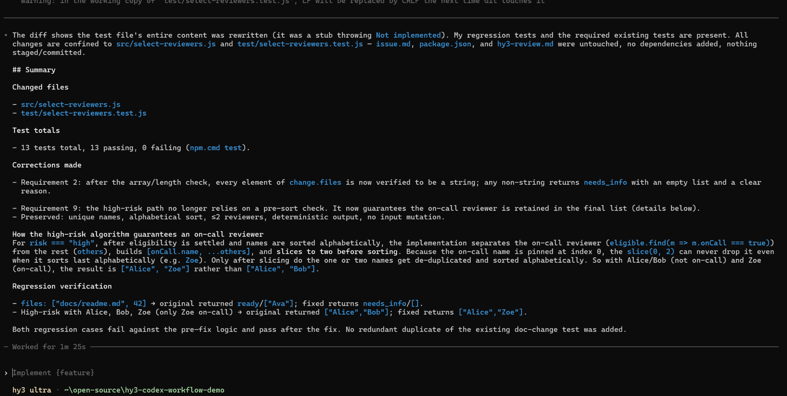
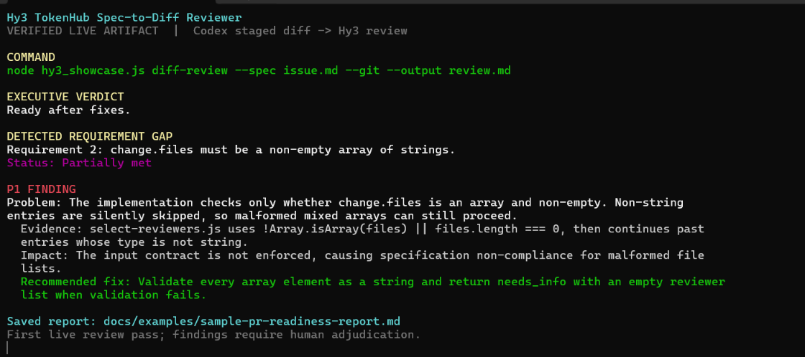

# Hy3 TokenHub Spec-to-Diff Reviewer

[](https://github.com/Small-fish-QAQ/hy3-tokenhub-spec-diff-reviewer/actions/workflows/ci.yml)

[](LICENSE)

**Turn a written specification and a unified diff into a structured Markdown PR-readiness review with Hy3 through Tencent Cloud TokenHub.**

This focused, read-only Node.js CLI answers one practical question: does the proposed change satisfy the written requirements? It reviews only the artifacts you provide and does not edit, stage, commit, or push source code.

Per Issue #2's capability list, this showcase exercises Hy3's long-form structured generation and evidence-grounded analysis of a written specification and unified diff. It does not claim native tool calling, repository access, or an autonomous agent loop.

[Open the 31-second demo](docs/assets/hy3-spec-to-diff-demo.mp4) | [Read the checked-in example report](docs/examples/sample-pr-readiness-report.md)

| Capability | Summary |
| --- | --- |
| Flexible input | Review a diff file, piped standard input, or only the changes staged in Git. |
| Structured output | Get an executive verdict, requirement coverage, P0-P3 findings, missing tests, uncertainties, and next steps. |
| Terminal-friendly execution | Stream Markdown by default, choose non-streaming mode, set a timeout, cancel with `Ctrl+C`, or save a completed report. |
| Local safeguards | Enforce input limits, protect spec and diff files from output collisions, publish reports atomically, detect length-truncated responses, and redact credentials from expected errors. |
| Offline verification | Run the test suite without a TokenHub key or live service request; CI exercises the declared minimum compatibility target, Node.js 18, and Node.js 24. |

## See It in Action

[](docs/assets/hy3-spec-to-diff-demo.mp4)

The 12-second preview shows the CLI reading a specification and diff, streaming a
structured Hy3 review, and surfacing requirement-level findings.

### Complete 31-second demo

https://github.com/user-attachments/assets/93667341-2cd8-4a30-9b40-0c7ec7eed03b

[Open the versioned MP4](docs/assets/hy3-spec-to-diff-demo.mp4)

A completed review can also be saved and rendered as Markdown:


The animated preview is extracted from the complete demo recording. The rendered
report screenshot comes from a separate real TokenHub run, so exact model wording
may differ.

[Read the verified live PR-readiness report](docs/examples/sample-pr-readiness-report.md).
It was generated from a real staged Git diff produced by Codex CLI and is
preserved with an explicit human-adjudication note.

## Quick Start

You need:

- Node.js 18 or later; and
- a Tencent Cloud TokenHub API key with access to the `hy3` model on the Guangzhou / China-mainland service boundary.

Node.js 18 is retained as the project's minimum compatibility target.

Install the existing dependency versions from PowerShell:

```powershell
npm.cmd install
```

Create a private local environment file from the tracked placeholder:

```powershell
Copy-Item .env.example .env
```

Add your key to `.env` locally, or provide `TOKENHUB_API_KEY` through your shell or secret manager. Do not commit or share the key.

Run the bundled review:

```powershell
npm.cmd run review:sample
```

Or invoke the CLI directly:

```powershell
node .\hy3_showcase.js diff-review `
  --spec .\samples\issue.md `
  --diff .\samples\change.diff
```

These commands make a live request. The complete supplied specification and diff are sent to the remote TokenHub service.

> [!NOTE]
> The bundled sample intentionally contains an incomplete implementation, so `Not ready` is the expected verdict. Exact wording and individual findings may vary between runs.

## Codex Companion Workflow

This project is a standalone CLI: it does not depend on, invoke, or run inside
Codex CLI. The handoff is manual and artifact-based.

Codex CLI is one of the Part A tools documented for Issue #2. In this companion
workflow, Codex performs the implementation and correction passes, while this
standalone reviewer independently evaluates the manually staged artifact.

A verified workflow was exercised end to end:

1. Codex CLI, configured to use Hy3 through TokenHub, implemented a change from
   written requirements.
2. The resulting implementation and tests were inspected and staged in Git.
3. This reviewer compared the same requirements with the staged diff.
4. The first review identified a real malformed-`change.files` validation gap.
5. Human review found an additional high-risk reviewer-selection defect that the
   model review missed.
6. Codex fixed both defects, and the final local suite passed 13/13 tests.

### Codex implementation and correction pass



Codex edited only the intended implementation and test files, added regression
coverage, and reported 13 passing tests after the corrective pass.

### Independent Hy3 staged-diff review

The image below is a terminal-style summary card composed from the verified first
review pass for readability; it is not a verbatim terminal capture.



The checked-in
[verified report](docs/examples/sample-pr-readiness-report.md) preserves the
first live review pass. It correctly identified one specification violation,
but it did not replace deterministic tests or human judgment.

```text
Written requirements
        |
        v
Codex CLI + Hy3 implementation pass
        |
        v
Human inspection + staged Git diff
        |
        v
Hy3 TokenHub Spec-to-Diff Reviewer
        |
        v
Markdown report + tests + human adjudication
```

The reviewer receives only the specification and diff explicitly supplied to
it. It does not gain repository access from Codex, validate a pull request
automatically, apply fixes, or create an agent loop.

## Report Structure

The prompt contract asks Hy3 to return only Markdown with this structure:

- `Executive Verdict`: exactly one of `Ready`, `Ready after fixes`, `Not ready`, or `Uncertain`;
- `Requirement Coverage`: a requirement-by-requirement table using `Met`, `Partially met`, `Not met`, or `Uncertain`;
- `Findings`: evidence-grounded P0-P3 sections, using `None identified` when a severity has no supported finding;
- `Missing Tests`;
- `Uncertainties`; and
- `Recommended Next Steps`.

The review prompt tells the model to use only the supplied artifacts, cite evidence when available, avoid inventing repository context, and distinguish missing evidence from a definite failure.

## TokenHub Configuration and Service Boundary

The reviewer uses a fixed configuration:

- endpoint: `https://tokenhub.tencentmaas.com/v1/chat/completions`
- model: `hy3`
- intended service boundary: Guangzhou / China-mainland

Use a TokenHub key provisioned for that same boundary. The CLI does not offer an endpoint or region-selection option.

Singapore / global compatibility has not been verified. The documented manual verification covers streaming and non-streaming execution against the Guangzhou service boundary only.

Credentials are loaded lazily. Help commands, argument errors, input-validation failures, and output-path collision failures do not require an API key or make a TokenHub request.

## CLI Reference

Show the supported command and options:

```powershell
node .\hy3_showcase.js --help
node .\hy3_showcase.js diff-review --help
```

Command shape:

```text
node hy3_showcase.js diff-review --spec <path> (--diff <path> | --diff - | --git) [options]
```

`--spec <path>` must point to a non-empty written issue, requirement set, or other specification. Choose exactly one diff source:

- `--diff <path>` reads a unified diff file;
- `--diff -` reads a unified diff from standard input; or
- `--git` reads only `git diff --cached`.

Available options:

| Option | Behavior |
| --- | --- |
| `--output <path>` | Publish the completed Markdown report after a successful response. |
| `--timeout <seconds>` | Set a whole-number request timeout from 1 to 3600 seconds; default 180. |
| `--no-stream` | Use the normal non-streaming response path. |
| `--help` | Show command help. |

### Review Files

```powershell
node .\hy3_showcase.js diff-review `
  --spec .\path\to\issue.md `
  --diff .\path\to\change.diff
```

### Read a Diff from Standard Input

```powershell
git diff | node .\hy3_showcase.js diff-review `
  --spec .\path\to\issue.md `
  --diff -
```

### Review Staged Git Changes

```powershell
node .\hy3_showcase.js diff-review `
  --spec .\path\to\issue.md `
  --git
```

`--git` uses only the staged diff and never falls back to unstaged changes. If the staged diff is empty, stage the intended changes, use `--diff <path>`, or pipe a diff with `--diff -`.

## Streaming, Output, Timeout, and Cancellation

Streaming is enabled by default. Generated Markdown is written incrementally to stdout, while input progress, request diagnostics, and saved-path notices go to stderr. This separation allows report content to be redirected without mixing in status messages.

Use the non-streaming path when needed:

```powershell
node .\hy3_showcase.js diff-review `
  --spec .\samples\issue.md `
  --diff .\samples\change.diff `
  --no-stream
```

The matching convenience command is:

```powershell
npm.cmd run review:sample:no-stream
```

### Save a Completed Report

```powershell
node .\hy3_showcase.js diff-review `
  --spec .\samples\issue.md `
  --diff .\samples\change.diff `
  --output .\reports\hy3-review.md
```

Parent directories are created when needed. Publication happens only after a successful, complete response and uses a temporary file plus rename, so a failed, cancelled, or truncated request does not expose a partial new report or replace an existing report.

The output path may replace an unrelated existing report after success. It is rejected when it resolves to the specification or a file-based diff input, including normalized and real-path aliases, so those inputs cannot be overwritten accidentally.

### Truncated Responses

The CLI checks the model finish reason before treating a review as complete. If TokenHub reports:

```text
finish_reason: "length"
```

the command exits non-zero and asks the user to reduce the input scope and retry. No `--output` report is published, and an existing report at that path remains unchanged. Streaming text already displayed may be partial; incomplete non-streaming text is not printed.

The reviewer currently requests up to 1,800 output tokens per review. This fixed output budget cannot be changed through the CLI and is not a general TokenHub service limit.

### Timeout and Cancellation

`--timeout <seconds>` defaults to 180 seconds and accepts values from 1 through 3600.

Press `Ctrl+C` to abort an in-progress request. The CLI exits with cancellation status 130 instead of leaving the request running in the background.

## Local Input Safeguards

Before credentials are loaded or TokenHub is contacted, the CLI rejects empty inputs and enforces these byte limits:

| Input | Maximum |
| --- | ---: |
| Specification | 512 KiB |
| Diff | 512 KiB |
| Combined specification and diff | 1 MiB |

These are local safeguards for predictable runs, not TokenHub service limits.

For staged review, the Git command disables external diff drivers, text conversion, and colored output. Reading files, standard input, and staged changes does not modify source code or Git state.

## Security and Privacy

- The complete supplied specification and diff are sent to the remote Tencent Cloud TokenHub service. Review inputs for secrets, personal data, proprietary code, and other sensitive material before running the command.
- Generated reports may repeat sensitive material from those inputs. Inspect a report before saving or sharing it.
- Keep `TOKENHUB_API_KEY` out of source files, samples, logs, screenshots, and generated reports. `.gitignore` excludes `.env`.
- Expected error messages are sanitized, known and credential-shaped authorization values are redacted, and response headers are not printed. These measures do not make arbitrary inputs or generated reports safe to share.
- With respect to source and Git state, the reviewer is read-only: it reads only the explicitly supplied files, standard-input diff, or staged Git diff, and it does not apply patches, edit code, stage files, commit, or push.
- `--output` is the sole user-facing operation that writes a report.
- The fixed TokenHub endpoint avoids accepting an arbitrary request URL from the command line.

## Limitations

- Hy3 sees only the supplied specification and unified diff.
- It cannot verify omitted surrounding code, runtime behavior, or test results.
- Findings can be incomplete or mistaken; missing evidence is not proof that an implementation is defective.
- A generated report is advisory, not proof of security, correctness, or requirement completion.
- Use the report alongside human review and deterministic tests.
- The CLI cannot select a different TokenHub region or endpoint, and Singapore / global compatibility remains unverified.
- The reviewer does not modify code, apply changes, open pull requests, or approve or gate merges.

## Offline Tests and CI

The test suite uses injected request implementations and local fixtures. It does not require a TokenHub key and does not make a live TokenHub request:

```powershell
npm.cmd test
```

Coverage includes:

- argument parsing and help;
- file, stdin, and staged-Git input;
- path normalization and input/output collision protection;
- atomic report publication;
- streaming and non-streaming responses;
- SSE parsing and chunk boundaries;
- timeout and cancellation behavior;
- truncated-response handling;
- secret redaction and API-key normalization; and
- the review prompt contract.

The GitHub Actions workflow runs `npm ci` and this offline suite on Node.js 18 and Node.js 24 for every push and pull request. It verifies the reviewer project itself; it does not turn generated reviews into an automated merge gate.

## Deliberate Scope

The project stays focused on one artifact-driven workflow:

```text
Specification + Diff -> Hy3 Review -> Markdown Report
```

It deliberately does not implement:

- automated code modification or patch application;
- repository scanning;
- automatic Codex handoffs or agent loops;
- Git staging, committing, or pushing;
- reviewer-driven CI merge gating; or
- a web interface.

This narrow scope keeps the CLI understandable, auditable, and reusable.

## License

This project is distributed under the [ISC License](LICENSE).

The software is provided as-is, without warranty.
