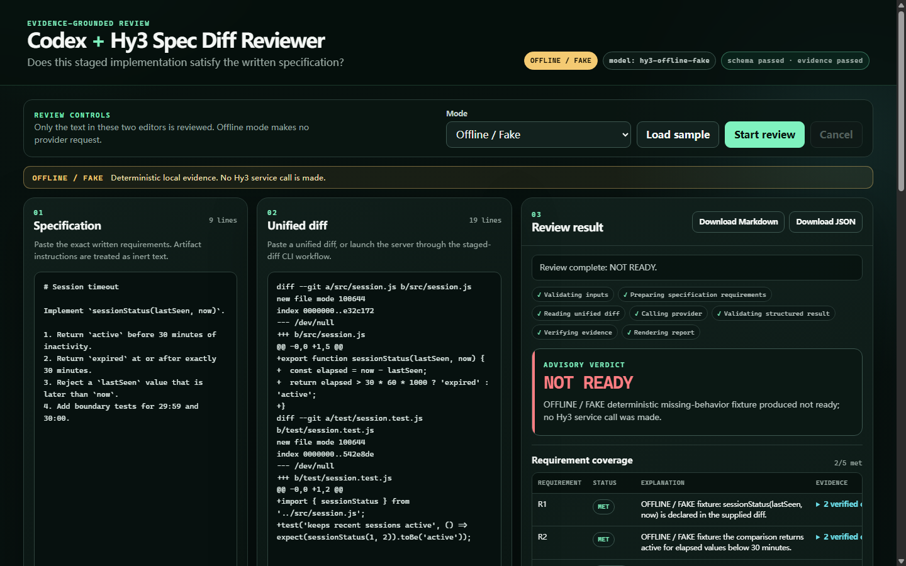

# Codex + Hy3 Evidence-Grounded Spec Diff Reviewer

**Does the staged implementation satisfy the written specification?**

Codex modifies code → a human stages the intended diff → the repository workflow invokes Hy3 → local code validates the structured result and every cited location → Markdown and JSON report **READY**, **NOT READY**, or **NEEDS INFORMATION** with requirement coverage, P0–P3 findings, missing tests, uncertainties, and verifiable provenance.

The reusable review engine is a standalone CLI. Its primary issue-2 workflow is invoked by Codex CLI after a developer stages a change. It is not a native Codex extension and never edits source files or Git state.



_Real local Chrome capture at 1440×900 using the deterministic **OFFLINE / FAKE** provider._

## One-minute path

No credential is needed:

```powershell
npm ci
npm run demo:offline
```

The deterministic sample produces **NOT READY** with **2/5 met**: R1 and R2 are met, while R3, R4, and R5 are missing. Its two P1 findings cover the strict `>` check that leaves exactly 30:00 active and the absent rejection of a future `lastSeen`; its three missing tests cover 29:59, exactly 30:00, and `lastSeen > now`. It uses the same input preparation, streaming-shaped provider path, JSON contract, evidence validation, renderer, and atomic output bundle as live mode. Every terminal stage and artifact is labelled **OFFLINE / FAKE**.

For the focused local browser console:

```powershell
npm run serve
# Open the printed loopback URL, load the sample, and select Start review.
```

The existing [31-second live TokenHub recording](docs/assets/hy3-spec-to-diff-demo.mp4) is real evidence for the original CLI core, but it predates the structured/evidence/browser upgrades. See [the recording plan](docs/DEMO.md) for the updated 50–55 second offline or live capture; do not present an offline result as live.

## Codex staged-diff workflow

Codex uses the repository's supported [`AGENTS.md`](AGENTS.md) guidance to invoke a thin wrapper after the intended change is staged:

```powershell
npm run review:staged -- --spec examples/spec.md --output reports/review.md
```

The wrapper adds only `--git` and calls the same exported CLI entrypoint as direct use. The reviewer executes this read-only command:

```text
git diff --cached --no-ext-diff --no-textconv --no-color
```

An empty staged diff fails clearly. The reviewer never falls back to unstaged files, stages changes, commits, resets, checks out files, or changes the working tree. The human owns the specification, staged scope, test execution, security review, and merge decision.

Full boundary and command details: [Codex workflow guide](docs/CODEX_WORKFLOW.md).

## Live TokenHub setup

Create a region-scoped TokenHub key and keep it in a local secret store or `.env` (which is ignored):

```dotenv
TOKENHUB_API_KEY=your_tokenhub_api_key_here
HY3_BASE_URL=https://tokenhub.tencentmaas.com/v1
HY3_MODEL=hy3
```

| Region | Base URL | Status here |
| --- | --- | --- |
| Guangzhou / China mainland | `https://tokenhub.tencentmaas.com/v1` | Safe default; previously live-tested |
| Singapore / global | `https://tokenhub-intl.tencentmaas.com/v1` | Officially documented; not tested in this repository |

The key and endpoint must belong to the same region. Tencent's official docs support authenticated `GET /v1/models`, so preflight sends no specification or diff:

```powershell
npm run check
```

It distinguishes endpoint failure, authentication failure, unavailable/offline model, explicit region errors, malformed responses, and timeout. A generic `401` is reported as authentication failure with a region diagnostic hint; it is not falsely claimed as proven region mismatch.

Official references: [API domains and model list](https://cloud.tencent.com/document/product/1823/130078), [API-key regions and access scope](https://cloud.tencent.com/document/product/1823/130090), [Hy3 invocation](https://cloud.tencent.com/document/product/1823/132252), and [error codes](https://cloud.tencent.com/document/product/1823/131595).

Then run one bounded live review:

```powershell
npm run review:staged -- --spec examples/spec.md --output reports/review.md
```

The repository includes the [sanitized record of one bounded live verification](docs/evidence/live-verification-2026-07-22.md). It records the real finish reason, request-ID presence, hashes, and validation outcome without retaining credentials or absolute paths.

## Direct CLI

The standalone core remains available outside Codex:

```powershell
# File inputs
node hy3_showcase.js diff-review --spec issue.md --diff change.diff

# Standard-input diff
git diff | node hy3_showcase.js diff-review --spec issue.md --diff -

# Staged changes only
node hy3_showcase.js diff-review --spec issue.md --git --output reports/review.md

# Deterministic fixture
node hy3_showcase.js diff-review --offline --fixture missing-tests `
  --spec samples/offline/missing-tests/spec.md `
  --diff samples/offline/missing-tests/change.diff
```

Use `--no-stream`, `--timeout <1-3600>`, or one of the six offline fixtures: `compliant`, `missing-behavior`, `missing-tests`, `security`, `ambiguous`, and `prompt-injection`. Run `node hy3_showcase.js diff-review --help` for the complete reference.

## Review contract and evidence

Provider text is never treated as a completed Markdown report. Hy3 must return one JSON object with:

```json
{
  "verdict": "ready | not_ready | needs_information",
  "summary": "...",
  "coverage": [{
    "requirementId": "R1",
    "status": "met | partial | missing | uncertain",
    "explanation": "...",
    "evidence": []
  }],
  "findings": [{
    "severity": "P0 | P1 | P2 | P3",
    "title": "...",
    "explanation": "...",
    "evidence": [],
    "recommendation": "..."
  }],
  "missingTests": [],
  "uncertainties": []
}
```

Runtime validation rejects malformed JSON, missing/unknown fields, unknown enums, empty findings, truncation, content filtering, and unexpected finish reasons. Schema or evidence errors allow **one** repair call with the validation errors, bounded invalid output, and the immutable evidence catalog. Repair has its own 30-second ceiling and never loops.

Before a provider call, local code:

- normalizes UTF-8 line endings without stripping artifact content;
- assigns stable requirement IDs and specification lines;
- parses unified-diff paths plus added, deleted, and context locations;
- hashes the exact normalized specification and diff with SHA-256; and
- represents the artifacts as JSON data separated from system/task instructions.

After generation, local evidence validation rejects nonexistent requirement IDs, paths not in the reviewed diff, out-of-range or non-contiguous lines, and quotes that do not match the normalized input. `met` and `partial` coverage require both specification and diff evidence; a genuinely missing requirement can cite the specification and state that implementation evidence was not found.

These checks prove citation integrity, not semantic correctness. Hy3 conclusions remain advisory.

## Output and provenance

`--output reports/review.md` transactionally publishes:

- `reports/review.md` — human-readable verdict, coverage, findings, missing tests, uncertainties, evidence, and provenance;
- `reports/review.json` — the same validated result plus its compact provenance manifest.

Both files are staged, synchronized, and atomically renamed. A failed validation, cancellation, timeout, provider failure, or publication error leaves no partial new report and rolls an existing bundle back.

Provenance includes tool/version, live or offline mode, model, sanitized provider host, streaming mode, timestamp, exact input hashes and counts, finish reason, schema/evidence status, safe request ID when provided, repair status, and output-format version. It excludes API keys, authorization headers, environment dumps, absolute user paths, and source content beyond validated evidence quotes.

## Reliability and security

- One total request timeout and propagated `AbortSignal`; Ctrl+C exits with code 130.
- At most two retries for temporary network errors, HTTP 408/429, and documented retryable 5xx codes.
- Bounded exponential backoff with jitter; valid `Retry-After` is honored within the total bounded window.
- No retries for bad credentials, unavailable/unsupported models, malformed requests, local validation failures, cancellation, or schema repair errors.
- Secrets are redacted from HTTP bodies, nested provider errors, retry failures, preflight, browser errors, and top-level CLI errors.
- Specification and diff content is inert data. Artifact text cannot choose paths, provider settings, output locations, permissions, network requests, or shell commands.
- Prompt-injection risk is reduced through JSON data boundaries, no artifact-driven tools, bounded inputs, strict schema validation, and local evidence validation; it is not eliminated.

## Browser console

The browser is a thin loopback-only shell over the same `reviewArtifacts` engine—there is no second review pipeline. It provides:

- three-column specification, unified diff, and structured result layout;
- bundled sample, Offline / Live mode, immediate progress, cancellation, and duplicate/stale-response prevention;
- verdict, coverage matrix, P0–P3 findings, expandable evidence, missing tests, uncertainties, hashes, and validation status;
- client-side Markdown/JSON downloads of the already validated response; and
- associated labels, keyboard operation, visible focus, `aria-live` status, disabled states, readable contrast, responsive layout, and reduced-motion support.

The key stays server-side. The server binds to loopback by default, checks Host/origin, serves a fixed file whitelist, enforces request and core artifact limits, returns no raw provider stack trace, and offers no arbitrary file or shell endpoint.

## Offline evaluation and tests

```powershell
npm run lint
npm test
npm run eval:offline
```

The six self-authored, license-safe regression cases measure schema validity, exact verdict and per-requirement status maps, exact met counts, fixture-specific findings and missing tests, citation validity, fabricated-evidence rejection, secret redaction, prompt-injection boundaries, deterministic output, and absence of partial output after failure/cancellation. Named fixtures fail when an expected requirement or exact diff selector cannot be resolved; unknown automatic input remains uncertain instead of defaulting to met. This small corpus is regression evidence, not a claim of benchmark superiority. Live evaluation never runs automatically in CI.

## Scope and limitations

This repository intentionally has no database, login, accounts, history system, RAG, vector store, autonomous coding loop, automatic staging/commits, PR commenting, or cloud deployment layer.

Remaining model-dependent limits:

- local evidence checks cannot prove behavioral correctness or detect every missing semantic relationship;
- requirement extraction is deterministic Markdown heuristics, not a formal requirements language;
- a listed TokenHub model may still be inaccessible to a key with different scope, which an actual live call can reveal;
- transient provider behavior and model output quality remain external dependencies; and
- the updated browser/Codex workflow media still requires an honest manual recording (offline if no credential, live only after successful preflight).

## License

[ISC](LICENSE)
